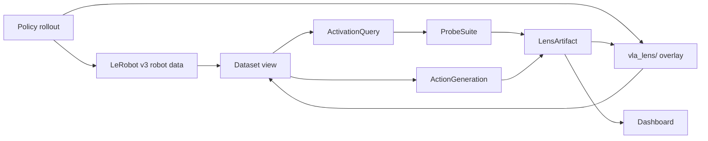

# VLA-lens

Episode-aligned interpretability packaging for Vision-Language-Action robot
policies.

VLA-lens uses LeRobotDataset v3 as the canonical robot-data layer, then adds a
`vla_lens/` interpretability overlay for model internals, policy-call alignment,
token metadata, probes, artifacts, and dashboard state. It provides selectors,
probes, action-head analysis, reusable artifacts, and a local dashboard for
inspecting what a policy saw, represented, and planned over time.

The main idea:

```text
HF model + environment + capture profile
-> LeRobot v3 robot data
-> VLA Lens interpretability overlay
-> linked visual workbench and reproducible analyses
```

Current docs entrypoint: [docs/README.md](docs/README.md). Current operational
state and known-good commands: [docs/current-state.md](docs/current-state.md).
Dataset format contract: [docs/dataset-format.md](docs/dataset-format.md).

## Reviewer Quick Start

Run the portable checks:

```bash
scripts/check_vla_lens.sh
```

Start a synthetic demo dataset, local backend, and React workbench:

```bash
scripts/run_vla_lens_demo.sh
```

Open:

```text
http://127.0.0.1:5173/
```

This path proves the package, trace contract, backend APIs, and frontend build
without requiring PI0.5, LeRobot, LIBERO, Torch, or GPU hardware.

Run the same dashboard path in Docker:

```bash
scripts/docker_dashboard.sh
```

Open:

```text
http://127.0.0.1:8080/
```

Point either dashboard path at an existing LeRobot v3 + `vla_lens/` dataset
root:

```bash
scripts/view_vla_lens.sh runs/pi05-light-5-test
scripts/docker_dashboard.sh runs/pi05-light-5-test
```

For hardware capture setup:

```bash
scripts/setup_pi05_rocm_env.sh  # AMD ROCm
scripts/setup_pi05_cuda_env.sh  # NVIDIA CUDA
scripts/setup_pi05_mps_env.sh   # Apple Silicon MPS
```

For Linux capture in Docker:

```bash
scripts/docker_pi05_cuda.sh --config configs/pi05_light_5_test.yaml --run
scripts/docker_pi05_rocm.sh --config configs/pi05_light_5_test.yaml --run
```

For high-volume capture, make the dataset destination explicit:

```bash
scripts/docker_pi05_rocm.sh \
  --config configs/pi05_light_5_test.yaml \
  --output-root /mnt/nvme/vla-lens/pi05-light-5-test \
  --run
```

More detail: [docs/hardware-run-paths.md](docs/hardware-run-paths.md),
[docs/docker.md](docs/docker.md), and
[docs/cloud-capture.md](docs/cloud-capture.md).

## What You Can Do

- Run PI0.5 in LIBERO and receive reusable robot/interp capture artifacts.
- Import compatible capture directories into the same dataset/overlay contract when needed.
- Browse datasets and open individual robot episodes.
- Inspect frames, prompts, actions, model data, feature activations, image-token overlays,
  expert/action-token activations, and generation/action-flow traces.
- Choose PI0.5 capture profiles for rollout, features, mechanistic_sampled,
  mechanistic_all, internals_sampled, audit_sampled, audit_windowed,
  audit_full, or custom interpretability budgets.
- Run a dataset analyzer that recommends defensible next analyses with concrete evidence.
- Generate compressed episode videos from recorded policy decisions.
- Train probe suites from YAML specs and save them as `LensArtifact`s.
- Save VLA-specific `ActionGeneration` artifacts that summarize how action chunks form over
  generation steps.

## Package Split

`src/vla_lens` is the framework:

- `traces.py`: dataset indexes, array loading, artifact persistence, and legacy
  trace-bundle views.
- `selectors.py`: axis-aware activation selection and feature matrix caching.
- `artifacts.py`: saved analysis records with provenance and display metadata.
- `analyzer.py`: dataset-aware analysis recommendations.
- `probes/`: probe training workflows and baselines.
- `action_generation.py`: action-head generation summaries.
- `server.py`: local dashboard APIs.
- `capture/`: LeRobot v3 robot-data contract, overlay helpers, and generic
  capture record/adapter contracts.
- `pi05/`: PI0.5-specific selectors, replay, and intervention specs.

## Quick Start

Serve an existing LeRobot v3 dataset root:

```bash
uv run python scripts/serve_vla_lens_dashboard.py runs/pi05-light-5-test --port 8765
```

Open:

```text
http://127.0.0.1:8765/
```

Capture PI0.5 episodes with the current PI0.5 writer:

```bash
scripts/pi05_batch_capture_rocm.sh --config configs/pi05_light_5_test.yaml --run
```

This writes LeRobot v3 robot data under `meta/`, `data/`, and `videos/`, plus
VLA Lens internals under `vla_lens/`. The old `.vlatrace` bundle format remains
only as a legacy test/demo storage path.

### PI0.5 Hardware Capture Environments

PI0.5/LeRobot/LIBERO capture uses dedicated hardware environments. This is
intentional.

Use this split:

```text
Normal repo/dev/test/server work:
  .venv
  uv run ...

PI0.5 capture work:
  .venv-pi05-rocm / .venv-pi05-cuda / .venv-pi05-mps
  scripts/pi05_capture.sh --backend rocm|cuda|mps ...
  scripts/pi05_batch_capture.sh --backend rocm|cuda|mps ...
```

Do not run PI0.5 capture with plain `uv run vla-pi05-capture` or
`uv run vla-pi05-batch-capture` on this workstation. `uv run` may sync the
normal repo lock into `.venv`, restoring dependencies that break the
LeRobot/LIBERO capture stack. In particular, capture currently needs ROCm Torch,
OpenPI-patched Transformers, `hf-libero`, and `robosuite==1.4.0`, while the
normal repo lock is for development/server/test work.

Set up the capture environment once:

```bash
scripts/setup_pi05_rocm_env.sh
scripts/setup_pi05_cuda_env.sh
scripts/setup_pi05_mps_env.sh
```

The first setup downloads Torch and model/runtime dependencies, which can be
several GiB. The capture wrappers validate the environment before running so a
missing or half-built capture virtualenv fails loudly.

More detail: [`docs/hardware-run-paths.md`](docs/hardware-run-paths.md) and
[`docs/pi05-rocm-capture-env.md`](docs/pi05-rocm-capture-env.md).

Testing follows the same split. Normal repo tests run with `uv run pytest` in
`.venv` and should not require Torch/LeRobot/GPU. Real PI0.5 capture smokes run
through `scripts/pi05_capture.sh --backend ...` or
`scripts/pi05_batch_capture.sh --backend ...` after
`scripts/check_pi05_env.sh --backend ...` passes.

The batch runner is the normal run surface. It writes an `episode_plan.csv`
containing one row per intended episode:

```csv
dataset_id,benchmark,task_id,seed,split,capture_profile
pi05-light-5-test,libero_object,0,1300,train,mechanistic_sampled
```

Each captured episode stores that value as `manifest.metadata.dataset_id`. The
CSV controls dataset/task/seed/profile variation; the capture code stays one
package-native command.

For schema/UI smoke testing, run a tiny matrix over all capture profiles:

```bash
uv run python scripts/run_capture_profile_smoke.py \
  --model-id lerobot/pi05_libero_finetuned \
  --episodes 2 \
  --delete-existing \
  --capture-command 'scripts/pi05_capture.sh --backend rocm --model-id {model_id} --episodes {episodes} --start-seed {start_seed} --capture-profile {profile} --dataset-id {dataset_id} --vlatrace-out-root {traces_root}'
```

The smoke script owns the profile roots and LeRobot-root validation. The runner
command is a template because the concrete PI0.5 capture
entrypoint is model/environment-specific.

Run dataset diagnostics:

```bash
uv run python scripts/save_vla_lens_dataset_report.py runs/pi05-light-5-test
```

Train a probe from a YAML spec:

```bash
uv run python scripts/train_vla_lens_probe.py runs/pi05-light-5-test --spec - <<'YAML'
name: Outcome probe over expert action features
target:
  kind: outcome
features:
  module: pi05.expert.layers.*
  tensor_type: hidden_tokens
  token_kind: action
  layers: null
  timesteps: all
  generation_step: null
  reduction: mean
split:
  kind: heldout_benchmark
baseline:
  - majority_class
  - benchmark
  - target_object
sweep: layer
YAML
```

Save an action-generation artifact:

```bash
uv run python scripts/save_vla_lens_action_generation.py runs/pi05-light-5-test
```

Refresh the dashboard and open the Artifacts page to inspect saved results.

PI0.5 capture profiles are named `rollout`, `features`,
`mechanistic_sampled`, `mechanistic_all`, `internals_sampled`,
`audit_sampled`, `audit_windowed`, `audit_full`, and `custom`. In short: use
`scripts/pi05_batch_capture.sh --backend rocm|cuda|mps` for PI0.5
dataset-scale work on a configured capture machine.
`mechanistic_sampled` is the cheap default; `mechanistic_all` is the best
serious single-trace inspector profile; `audit_sampled` adds sampled-layer
circuit-boundary internals and is already large; `audit_windowed` captures
whole-episode adjacent layer windows (`0,1`, `4,5`, `8,9`, `12,13`,
`16,17`) for transcoder/circuit work; `audit_full` adds all-layer raw forward
internals and is intentionally expensive.
Sampled PI0.5 model profiles capture the same VLM and expert layer indices
(`0, 4, 8, 12, 17`) so inspected prefix K/V pairs line up as
`VLM L_i -> Expert L_i`.
For a profile-by-profile interpretability guide, see
[docs/pi05-capture-profiles.md](docs/pi05-capture-profiles.md).

Use `dataset_id` for capture-run provenance. The LeRobot + overlay writer stores
it in overlay manifest metadata and in generated `episode_plan.csv` /
`probe_splits.csv` files so datasets can stay flat-ish while still being easy to
filter and audit.

Use `capture_design=paired_counterfactual` when two traces should be analyzed as
one clean/corrupt unit. This is a design layer over profiles, not a new tensor
profile: each side can still use `mechanistic_sampled`, `audit_sampled`, or any
other capture profile. Add `trace_variant` or `counterfactual_role` so the two
traces do not overwrite each other:

```csv
dataset_id,benchmark,task_id,seed,split,capture_profile,counterfactual_group_id,counterfactual_role,counterfactual_type,changed_fields,matched_fields,target_object_id
pi05-pairs-v0,libero_goal,1,42,train,mechanistic_sampled,pair-0001,clean,prompt_target_swap,prompt.target_object,"benchmark,task_id,seed,initial_object_poses,camera_config",mug
pi05-pairs-v0,libero_goal,1,42,train,mechanistic_sampled,pair-0001,corrupt,prompt_target_swap,prompt.target_object,"benchmark,task_id,seed,initial_object_poses,camera_config",bowl
```

The batch runner writes trace IDs like
`pi05_mechanistic_sampled_libero_goal_task1_seed42_clean` and
`pi05_mechanistic_sampled_libero_goal_task1_seed42_corrupt`, stores the
counterfactual metadata in each manifest, and the dashboard exposes pair groups
through `/api/dataset` and `/api/counterfactual-pairs`.

The overlay writer also stores fast provenance fingerprints in
`vla_lens/episodes/.../tables/fingerprints.json`,
`manifest.metadata.fingerprints`, and `capture_report.fingerprints`:

- `trajectory_fingerprint`: action/generation trajectory plus timestep-policy mapping.
- `context_fingerprint`: object/robot/camera/evaluation/preprocessing context.
- `trace_schema_fingerprint`: token/model-site/table semantics and capture request/plan/report.
- `trace_fingerprint`: the combined trace identity for provenance checks.

Probe artifacts record source episode fingerprints plus the concrete feature
matrix, target, and row-index fingerprints, so a later probe result can tell
whether behavior, context, trace semantics, or the extracted training data changed.

## Trace And Artifact Workflow



## Dataset Analyzer Philosophy

The analyzer should guide researchers with evidence, not jargon.

Good guidance looks like:

```text
Outcome probe is possible.
Evidence: 14 success and 6 failure episodes are available.
Risk: 0/20 tasks have both success and failure, so task identity can be confused with behavior.
Suggested artifact: ProbeSuite over expert action-token features with benchmark/object baselines.
```

Bad guidance looks like:

```text
Warning: seed split invalid.
```

The goal is to help a researcher choose analyses that the current dataset can actually support.

## Current Direction

The dashboard remains episode-first for inspection:

- Home: dataset analyzer and artifact overview.
- Episodes: browse and inspect robot episodes.
- Artifacts: saved probes, videos, reports, action-generation summaries, and future analysis outputs.

Artifacts are becoming the durable research objects. Every serious analysis should save:

- source episodes
- selector/spec
- method
- metrics
- display data
- linked dashboard state when possible

## Development

Run checks:

```bash
uv run ruff check src tests scripts
uv run pytest
```

Run the focused trace MVP tests:

```bash
uv run pytest tests/vla_lens_trace_mvp_test.py
```
