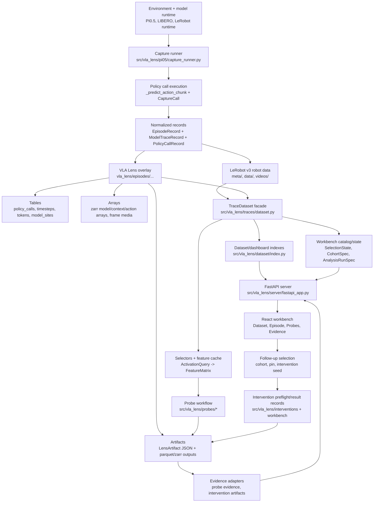

# 00 - Executive System Map

Inspected commit: `882eeb83be8c8a69a80fc8f6ec8829c311ca4630`

Creation status: the worktree was clean before the audit files were generated. The audit was later preserved on the dedicated `codex/system-review-audit` branch.

Inspection mode: static code, docs, and tests only. No captures, simulators, model downloads, servers, broad tests, or destructive commands were run.

Commands used: `git rev-parse HEAD`; `git status --short`; `find`; `rg`; `wc -l`; targeted `nl -ba ... | sed -n ...` reads across `src/vla_lens`, `tests`, `frontend/src`, `docs`, `scripts`, and `pyproject.toml`; review of audit files `01` through `06`.

## Current Identity

VLA Lens is implemented as a local research workbench over LeRobot v3 datasets, with a `vla_lens/` overlay that adds model-internal traces, policy-call alignment, derived labels, artifacts, workbench state, and dashboard indexes. The README identity matches the code: LeRobot remains the canonical robot-data layer, while VLA Lens owns interpretability overlay data (`README.md:6`, `src/vla_lens/dataset/reader.py:31`, `src/vla_lens/traces/dataset.py:32`).

Implemented layers:

- Robot-data storage: LeRobot v3 roots with `meta/`, `data/`, and `videos/`, opened through `open_lerobot_dataset` and surfaced as `TraceDataset` (`src/vla_lens/dataset/reader.py:31`, `src/vla_lens/traces/dataset.py:40`).
- Captured model execution: PI0.5/LIBERO capture records `CaptureCall`, `PolicyCallRecord`, model-site arrays, token metadata, generation steps, and capture reports (`src/vla_lens/pi05/capture_runner.py:224`, `src/vla_lens/pi05/capture_writer.py:63`, `src/vla_lens/capture/records.py:19`).
- Derived scientific semantics: PI0.5 interaction/object-flow/policy-call label artifacts and probe row metadata joins exist, but they are method/PI0.5 oriented rather than a generic annotation catalog (`src/vla_lens/probes/workflow_prepare.py:21`, `src/vla_lens/pi05/policy_call_labels.py:1`).
- Analysis/training methods: probes are the mature path. They use `ActivationQuery`, feature materialization, target resolution, sklearn training, `LensArtifact`, prediction tables, and dashboard indexes (`src/vla_lens/selectors.py:21`, `src/vla_lens/probes/workflow_training.py:63`).
- Artifacts and evidence: `LensArtifact` is the durable envelope, with probe evidence adapters, intervention artifacts, evidence pins, and workbench analysis/intervention records layered around it (`src/vla_lens/artifacts.py:33`, `src/vla_lens/probe_evidence.py:1`, `src/vla_lens/workbench/schema.py:424`).
- API/backend: FastAPI serves dataset, episode, model-site, probe, artifact, workbench, cohort, table-query, and intervention preflight endpoints (`src/vla_lens/server/fastapi_app.py:51`).
- React workbench: one hash-routed React app with dataset, episode microscope, probes, and evidence/intervention pages (`frontend/src/App.tsx:1`, `frontend/src/pages/WorkbenchPage.tsx:19`).
- Dedicated model runtime: PI0.5 capture loads Torch/LeRobot/LIBERO lazily and is intentionally run through backend-specific wrappers, not the normal repo `uv run` environment (`src/vla_lens/pi05/capture_runner.py:175`, `README.md:152`).

The implemented product is already more than "a probe dashboard." It is a trace-aligned storage and inspection system whose general workbench layer is emerging, while experiment construction and evidence lineage are still mostly probe-led.

## Implemented Flow



## Current Maturity

| Subsystem | Status | Evidence | Main Gap |
|---|---|---|---|
| Robot-data plane | Present and coherent | LeRobot v3 root validation/opening and `TraceDataset` facade (`src/vla_lens/dataset/reader.py:31`, `src/vla_lens/traces/dataset.py:40`) | Full LeRobot ecosystem compatibility is narrower than the project writer contract. |
| Model-execution plane | Present and coherent, PI0.5-specific | Lazy runtime loader, capture plan, `CaptureCall`, model-site arrays (`src/vla_lens/pi05/capture_runner.py:175`, `src/vla_lens/pi05/capture_schema.py:93`) | Second-model adapter has not validated the site/capability abstractions. |
| Semantic/derivation plane | Partial and fragmented | Interaction/object-flow/policy-call labels are artifacts and probe joins (`src/vla_lens/probes/workflow_prepare.py:21`) | No generic annotation registry or versioned label catalog. |
| Experiment-construction plane | Present but fragmented | `ActivationQuery`, probe target resolver, splits, feature cache, workbench cohorts (`src/vla_lens/selectors.py:21`, `src/vla_lens/probes/workflow_targets.py:31`, `src/vla_lens/workbench/schema.py:313`) | No shared `ExperimentRecipe`/`ExampleManifest`; probes are the accidental orchestration layer. |
| Analysis-method plane | Partial | Probe suite is mature; action-generation and interaction metrics exist (`src/vla_lens/probes/workflow_training.py:63`, `src/vla_lens/action_generation.py:1`) | No method protocol for SAEs, transcoders, steering, attribution, or clustering. |
| Evidence plane | Partial | `LensArtifact`, probe evidence bundle, evidence pins, intervention artifacts (`src/vla_lens/artifacts.py:33`, `tests/evidence_pins_test.py:9`) | Method outputs, evidence, controls, claims, and lineage are not cleanly separated. |
| Intervention plane | Partial/spec-driven | Target specs, families, preflight, saved readouts, tests (`src/vla_lens/interventions/specs.py`, `src/vla_lens/interventions/preflight.py`, `src/vla_lens/workbench/schema.py:452`) | No live runtime execution/result vertical slice in normal workbench. |
| UI/workbench plane | Present but partially fragmented | Workbench page, episode microscope, dataset lens browser, evidence page (`frontend/src/pages/WorkbenchPage.tsx:19`) | Multiple selection models; many scientific states are local-only. |
| Runtime/dependency plane | Coherent split | README and capture runner separate normal `.venv` from PI0.5 runtime (`README.md:152`, `src/vla_lens/pi05/capture_runner.py:175`) | Need more boundary tests and runtime-output inspectability checks. |
| Extension/plugin plane | Mostly absent | Generic records and workbench panel registry exist (`src/vla_lens/capture/records.py:97`, `src/vla_lens/workbench/schema.py:361`) | No stable adapter/method plugin protocol yet. |

## Main Finding

The most important missing abstraction is not a single SQL table by itself. It is a reusable experiment/evidence contract centered on:

```text
cohort or population
+ observation unit, usually (trace_id, policy_call_index)
+ signal selection
+ target/label selection when supervised
+ transform/materialization policy
+ split/grouping policy
+ method runner
+ exact example manifest
+ typed result and evidence lineage
```

The closest implemented pieces already exist:

- `policy_calls.parquet` in each overlay bundle and practical `(trace_id, policy_call_index)` identity (`src/vla_lens/traces/bundle.py:47`, `src/vla_lens/capture/records.py:19`).
- `ActivationQuery` and `FeatureMatrix` for signal selection/materialization (`src/vla_lens/selectors.py:21`, `src/vla_lens/selectors.py:45`).
- `CohortSpec`, `SelectionState`, `AnalysisRunSpec`, and `SavedWorkspace` in the workbench layer (`src/vla_lens/workbench/schema.py:275`, `src/vla_lens/workbench/schema.py:313`, `src/vla_lens/workbench/schema.py:424`, `src/vla_lens/workbench/schema.py:488`).
- `LensArtifact` as the generic persistent envelope (`src/vla_lens/artifacts.py:33`).
- Probe artifacts that already save much of the needed recipe and provenance, but in probe-specific nested payloads (`src/vla_lens/probes/workflow_training.py:175`).

The immediate center of gravity should be to unify these existing pieces, not rewrite storage. A dataset-level policy-call index would help a lot, but the research pain is broader: researchers cannot yet declaratively ask for "model signal X over policy calls satisfying condition Y with target Z" and get a reusable population plus result contract that other methods can consume.

## Highest-Leverage Opportunities

### 1. Add a Dataset-Level Policy-Call Index

Concrete pain: policy calls exist per episode, but cross-dataset queries require unioning bundle tables and ad hoc joins to episode metadata, derived labels, and model-site availability.

Implicated files and symbols: `TraceBundle.POLICY_CALLS` (`src/vla_lens/traces/bundle.py:47`), `PolicyCallRecord` (`src/vla_lens/capture/records.py:19`), `build_dataset_index` (`src/vla_lens/dataset/index.py:173`), `query_table` (`src/vla_lens/workbench/tables.py:59`).

Proposed boundary: add rebuildable `vla_lens/tables/policy_call_index.parquet` with one row per `(trace_id, policy_call_index)` and scalar metadata only. Include a stable string `call_id`, episode/task/outcome fields, observation/env timestep span, action horizon, capture profile, available site summary, and optional derived label columns by reference/version.

Research value: makes policy calls the default unit for mechanistic experiments.

Software value: reduces repeated joins in probes, UI, interventions, and reports.

Risk: overloading it with high-dimensional tensors or unstable derived labels.

Do not change: keep activations in zarr arrays and keep raw LeRobot data authoritative.

### 2. Save a Generic Example Manifest for Analysis Runs

Concrete pain: probe artifacts save counts, fingerprints, predictions, and source rows, but not a reusable manifest of the exact selected examples after filtering/expansion/split.

Implicated files and symbols: `_probe_examples` (`src/vla_lens/probes/workflow_artifacts.py:154`), `train_probe_artifact` (`src/vla_lens/probes/workflow_training.py:63`), `SavedProbeSuite.rows` (`src/vla_lens/probes/workflow_types.py:19`), `AnalysisRunSpec` (`src/vla_lens/workbench/schema.py:424`).

Proposed boundary: write `example_manifest.parquet` beside analysis outputs and reference it from `LensArtifact.method.outputs` and `AnalysisRunSpec.outputs`. Start with probe rows; make columns method-neutral: example id, observation unit, source signal refs, target refs, split/group, and fingerprints.

Research value: lets another method reuse the same population without reverse-engineering probe payloads.

Software value: gives UI plots and interventions a stable source-row handle.

Risk: manifest schema could become too broad too early.

Do not change: keep method-specific prediction/model-state outputs separate.

### 3. Promote an Experiment Recipe Contract

Concrete pain: `ActivationQuery`, target specs, split specs, row filters, and method params live in probe YAML and private helpers.

Implicated files and symbols: `normalize_probe_spec` (`src/vla_lens/probes/workflow_spec.py:13`), `ActivationQuery` (`src/vla_lens/selectors.py:21`), `_resolve_probe_target` (`src/vla_lens/probes/workflow_targets.py:31`), `_ensure_split` (`src/vla_lens/probes/workflow_prepare.py:574`).

Proposed boundary: introduce a small serializable recipe object in or near `workbench/schema.py` or a new `experiments/` module. First implementation can wrap existing probe specs while exposing method-neutral fields: dataset, cohort/filter, unit, signal, target, transform, split, method, output contract, and source fingerprints.

Research value: turns "write custom glue" into repeatable experiment construction.

Software value: gives SAEs/transcoders/steering a shared launcher and provenance shape.

Risk: designing a speculative framework before a second method exists.

Do not change: do not rename coherent probe internals just for aesthetics.

### 4. Unify Scientific Selection State Across Backend, Frontend, and URLs

Concrete pain: the UI has backend `SelectionState`, TypeScript mirrors, `ResearchSelectionState`, `EpisodeInspectorSelection`, and local component state; many model/time/token choices are not deep-linkable.

Implicated files and symbols: backend `SelectionState` (`src/vla_lens/workbench/schema.py:275`), frontend route state (`frontend/src/pages/workbench/episodeRouteModel.ts:4`), Zustand store (`frontend/src/store/workbenchStore.ts:3`), evidence selection type (`frontend/src/types/probeEvidence.ts:208`).

Proposed boundary: define one generated or manually synchronized scientific selection contract with canonical axes, plus route encoding/decoding for dataset, episode, call, timestep, model site, token/action position, artifact/run, cohort, split, and intervention target.

Research value: lets a researcher move from summary plot to exact source moment without losing meaning.

Software value: reduces duplicated route/state adapters and fallback heuristics.

Risk: too much URL state can become unreadable.

Do not change: keep local-only controls for transient playback and visual tuning.

### 5. Standardize Artifact Evidence and Lineage

Concrete pain: `LensArtifact` is flexible, but method output, evidence, control, claim, lineage, and failure status are encoded differently by probes, interventions, pins, and workbench records.

Implicated files and symbols: `LensArtifact` (`src/vla_lens/artifacts.py:33`), probe method payload (`src/vla_lens/probes/workflow_training.py:175`), intervention artifacts (`src/vla_lens/interventions/artifacts.py:13`), `save_intervention_run` (`src/vla_lens/workbench/api.py:136`).

Proposed boundary: keep `LensArtifact`, add a small typed evidence/lineage convention: source recipe id, example manifest path, upstream artifacts, controls, status, failure reason, and supported observation type.

Research value: makes evidence chains inspectable without inventing "mechanistic" badges.

Software value: makes artifact comparison and recomputation less bespoke.

Risk: turning the tool into a publishing system.

Do not change: do not require every method to share identical metrics or plot schemas.

### 6. Establish One Intervention Vertical Slice

Concrete pain: intervention target/preflight/readout contracts exist, but the UI save path is inspection/preflight oriented and live runtime is absent from normal workbench.

Implicated files and symbols: intervention families/specs/preflight (`src/vla_lens/interventions/families.py`, `src/vla_lens/interventions/specs.py`, `src/vla_lens/interventions/preflight.py`), preflight route (`src/vla_lens/server/fastapi_app.py:588`), `InterventionRunSpec` (`src/vla_lens/workbench/schema.py:452`), PI0.5 runtime contract tests.

Proposed boundary: first vertical slice: source artifact/example -> target spec -> runtime preflight -> no-op/control/intervened action-level result -> saved `LensArtifact` and workbench run -> side-by-side UI.

Research value: tests whether decodable/located signals actually affect behavior.

Software value: validates site ontology and analysis-to-runtime handoff.

Risk: mixing capture runtime dependencies into normal dashboard.

Do not change: keep live execution in PI0.5 runtime wrappers, not FastAPI dashboard.

### 7. Add Boundary Tests Around the New Contracts

Concrete pain: the repo has strong tests, but not enough invariants for global policy-call identity, generic example manifests, selection round-trips, and artifact interpretation after index rebuilds.

Implicated files and symbols: existing tests in `tests/vla_lens_trace_workbench_test.py`, `tests/dataset_index_test.py`, `tests/lerobot_dataset_storage_test.py`, `tests/research_ui_import_boundary_test.py`.

Proposed boundary: add tests that create a small normal-lane synthetic dataset, build policy-call index, create a recipe/manifest-backed probe, rebuild indexes, deep-link a UI-style selection, and verify artifact evidence still resolves.

Research value: protects the exact relationships researchers rely on.

Software value: prevents future methods from duplicating probe-specific shortcuts.

Risk: tests become brittle if they assert current UI layout rather than contracts.

Do not change: do not require Torch, LeRobot, LIBERO, GPU, or real capture in normal tests.
