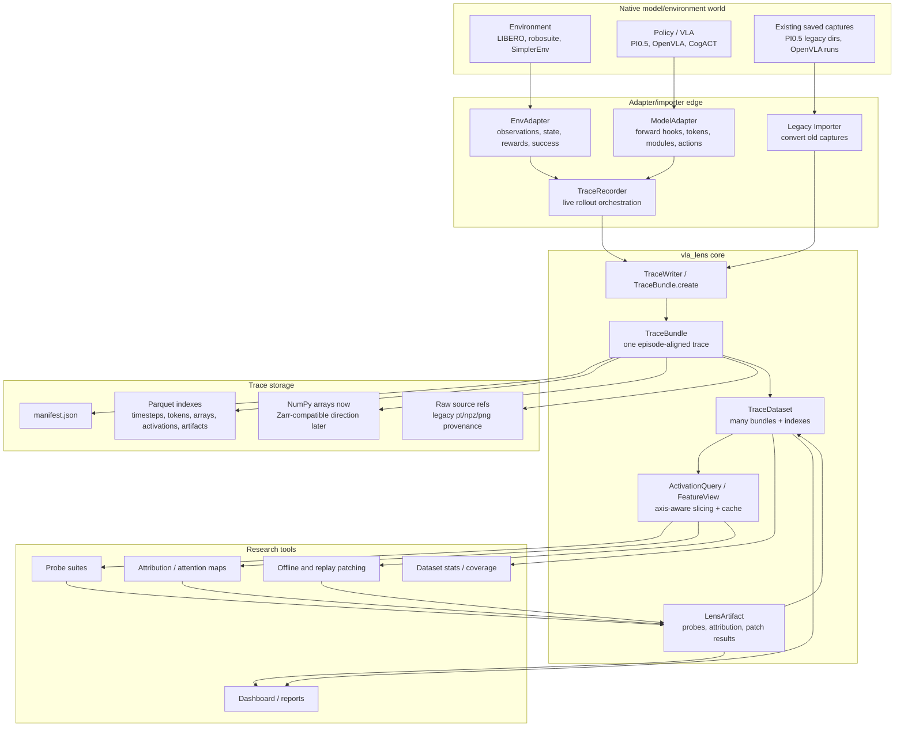
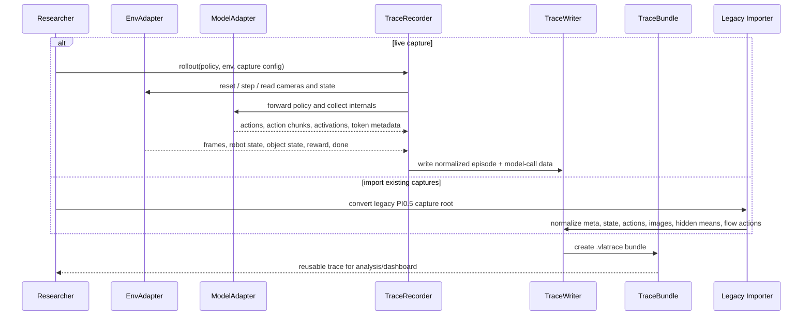
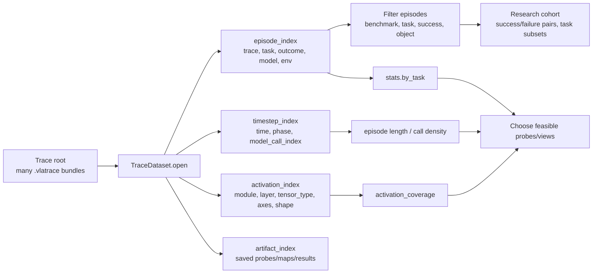
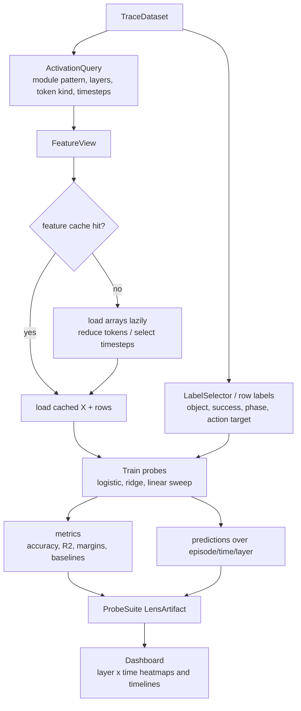
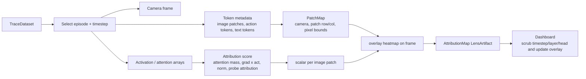
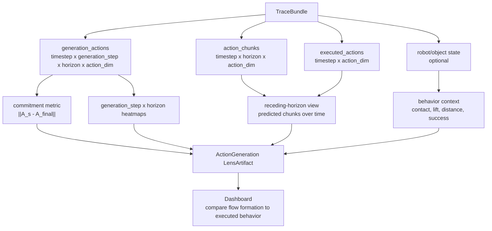
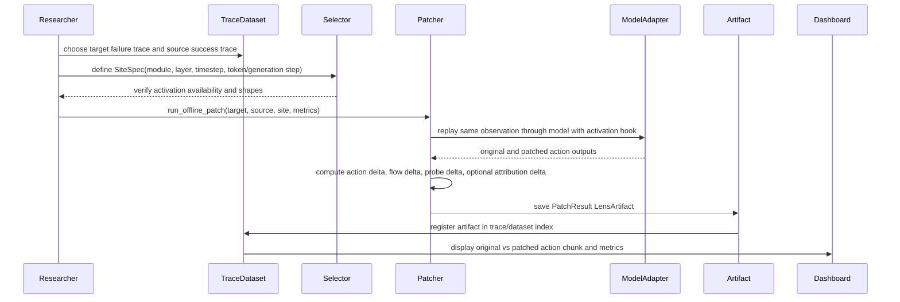

# VLA Lens Architecture And Workflows

## Architecture

## Workflow 1: Capture Or Import Into Trace Bundles

## Workflow 2: Dataset Browsing And Coverage

## Workflow 3: Probe Suite After Capture

## Workflow 4: Attribution Or Attention Overlay

## Workflow 5: Flow Action And Generation Analysis

## Workflow 6: Offline Patching And Intervention Results

