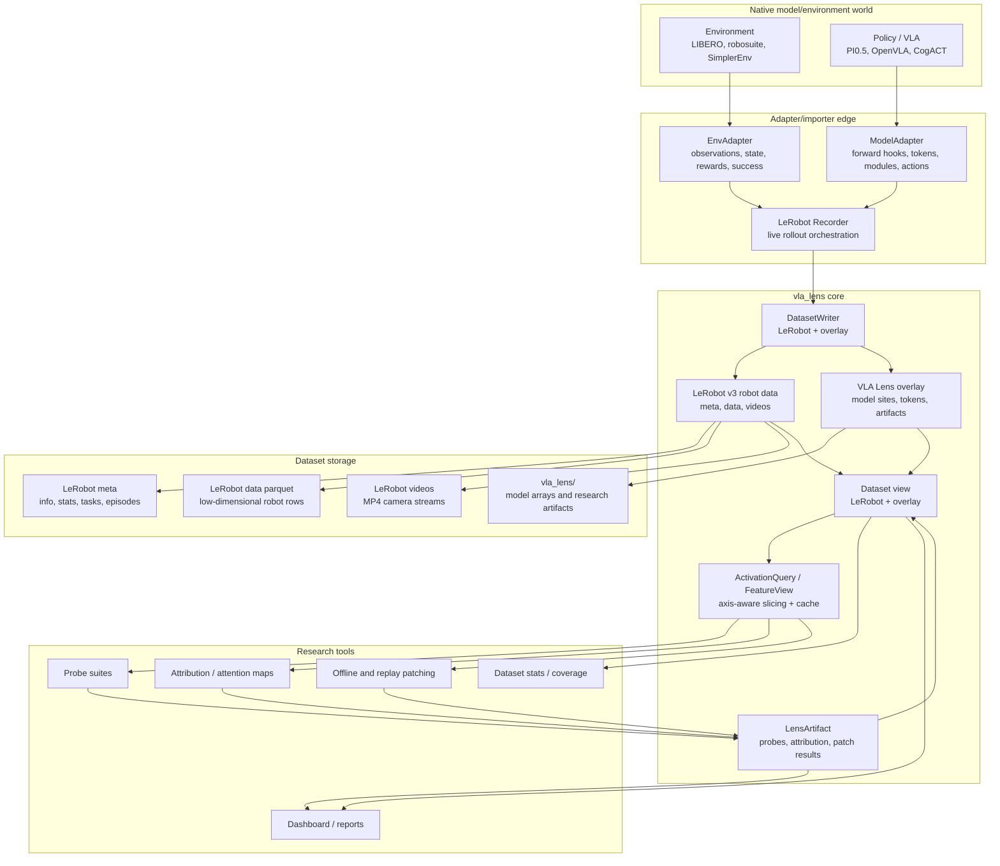
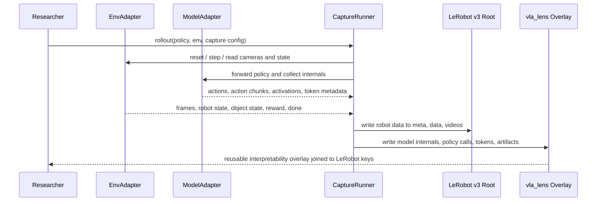
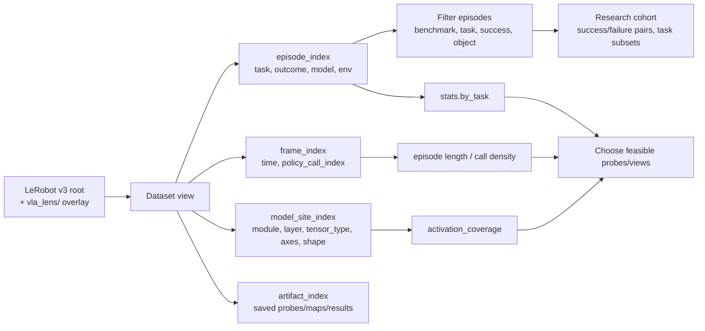
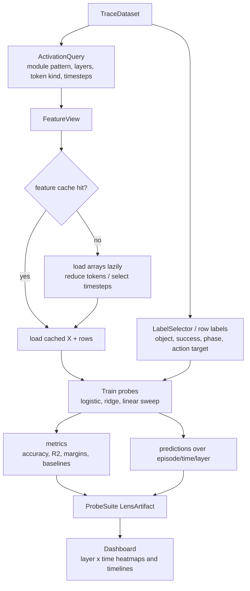
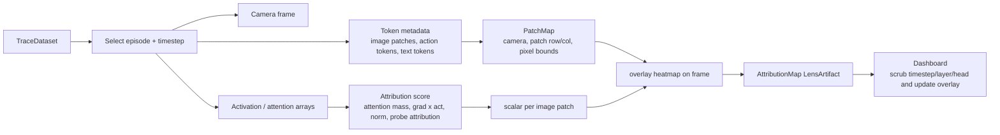
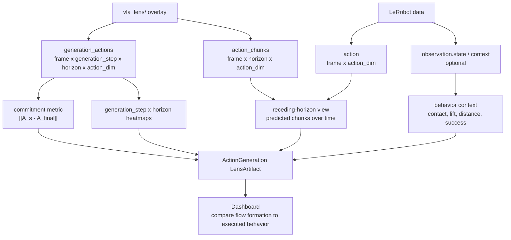
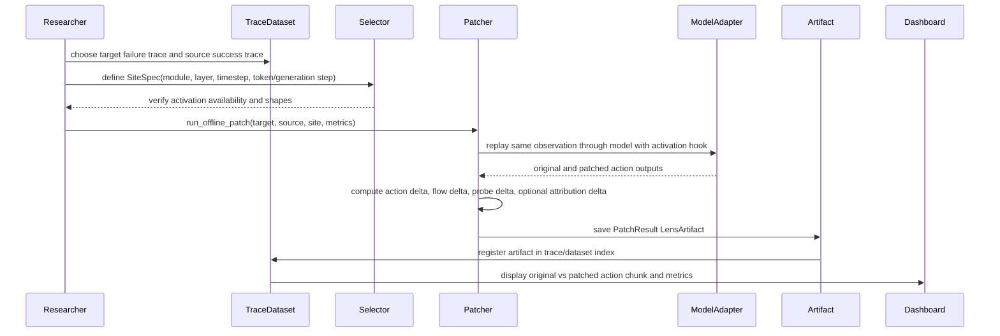

# VLA Lens Architecture And Workflows

Status: active architecture contract.

Last updated: May 27, 2026.

## Dataset Layer Cutoff

The canonical dataset shape is now LeRobotDataset v3 robot data plus a VLA Lens
overlay:

```text
LeRobot v3 meta/data/videos
  + vla_lens/ tables, arrays, artifacts, fingerprints
```

LeRobot owns observations, actions, episode/frame indexes, timestamps, task
metadata, and camera media. VLA Lens owns model internals, policy-call
alignment, token metadata, probes, artifacts, and dashboard state. Standalone
episode-bundle directories are an internal overlay primitive, not a dataset
compatibility layer.

## Architecture



## Workflow 1: Capture Or Import Into Dataset Roots



## Workflow 2: Dataset Browsing And Coverage



## Workflow 3: Probe Suite After Capture



## Workflow 4: Attribution Or Attention Overlay



## Workflow 5: Flow Action And Generation Analysis



## Workflow 6: Offline Patching And Intervention Results


